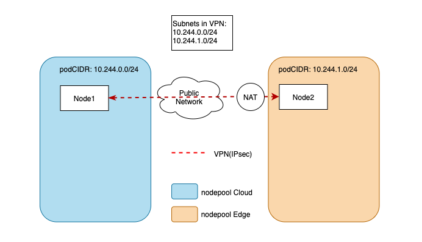
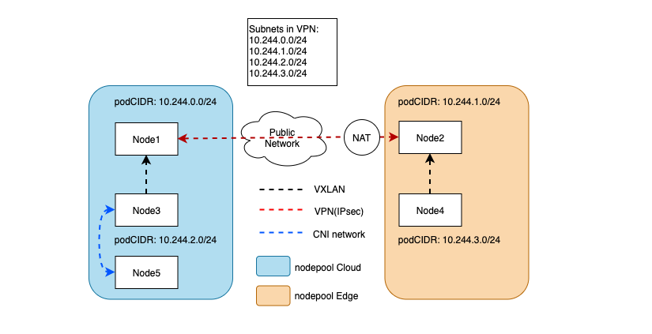
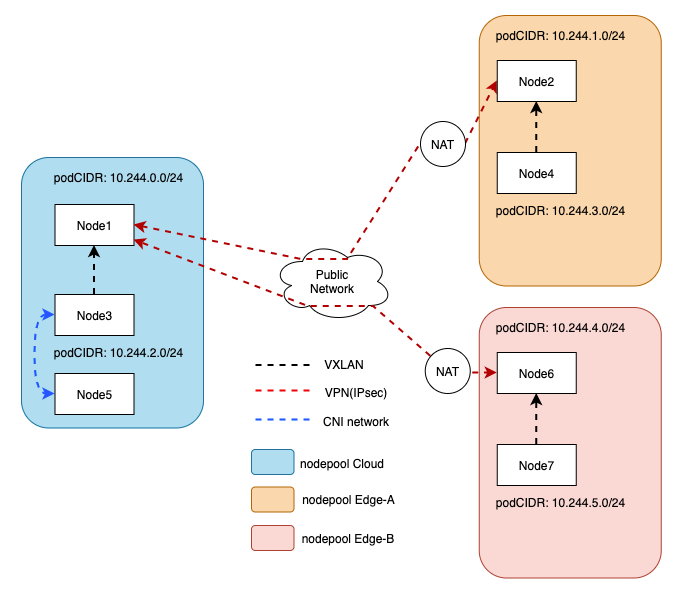

# Proposal to enhance the capabilities of cluster networking.

## Table of Contents
* [Proposal to enhance the capabilities of cluster networking.](#proposal-to-enhance-the-capabilities-of-cluster-networking)
  * [Table of Contents](#table-of-contents)
  * [Glossary](#glossary)
  * [Summary](#summary)
  * [Motivation](#motivation)
    * [Goals](#goals)
  * [Proposal](#proposal)
    * [New Components](#new-components)
      * [YurtMeshAgent](#yurtmeshagent)
    * [New CRDs](#new-crds)
      * [YurtGateway](#yurtgateway)
      * [YurtMeshTopology](#yurtmeshtopology)
    * [Network Reachability Requirement](#network-reachability-requirement)
    * [H/A Consideration](#ha-consideration)
    * [Node Autonomy Consideration](#node-autonomy-consideration)
    * [Host Network Restriction](#host-network-restriction)
    * [Network Path Across Nodepool](#network-path-across-nodepool)
      * [Pod on Gateway Node to Pod on Gateway Node](#pod-on-gateway-node-to-pod-on-gateway-node)
      * [Pod on Non-gateway Node to Pod on Gateway Node](#pod-on-non-gateway-node-to-pod-on-gateway-node)
    * [Network Path within the Nodepool](#network-path-within-the-nodepool)
    * [Test Plan](#test-plan)
    * [User Stories](#user-stories)
      * [Story 1](#story-1)
      * [Story 2](#story-2)
  * [Implementation History](#implementation-history)

## Glossary

Refer to the [Cluster API Book Glossary](https://cluster-api.sigs.k8s.io/reference/glossary.html).

## Summary

In this proposal, we will introduce a network solution for OpenYurt to enhance cluster networking capabilities.
This enhancement is focus on edge-edge and edge-cloud communication in OpenYurt.
In short, this solution will provide layer 3 network connectivity among pods in different physical region, as there are in one vanilla kubernetes cluster.

This proposal is inspired by [submariner](https://github.com/submariner-io/submariner), which is capable to connect multiple Kubernetes clusters.
Comparing to multi-cluster architecture, OpenYurt follows single cluster architecture design, which reduce the complexity.

## Motivation

Edge-edge and edge-cloud communication is a common issue in edge computing scenarios.
In OpenYurt, we have introduced YurtTunnel to cope with the challenges of O&M and monitoring in edge-cloud collaboration.

YurtTunnel provides the capabilities to execute kubectl exec/logs to edge nodes and scrap metric from edge nodes.

However, the problem that YurtTunnel solved is just a subset of edge-cloud communication, and currently there is no solution in OpenYurt for edge-edge communication.

In some scenarios, pods in different physical region in OpenYurt cluster may need to talk to others using pod IP, service IP,
or service domain name, as those pods are in a vanilla kubernetes cluster.

This proposal aims to make it possible.

### Goals

- Design a network model of OpenYurt to achieve cross-nodepool communication.
- Provide layer 3 network connectivity among pods across different nodepools, which means
  pods in different nodepools can talk to each other by using pod IP, service IP and service domain name, as there
  are in one vanilla kubernetes cluster.
- Replace the YurtTunnel.

## Proposal

To better understand the problems, let's start with the simplest case. Suppose we have two nodepool in different network region, one is
cloud nodepool and the other is edge nodepool. There are only one node in each nodepool. The cloud node have a
static public ip, while the edge node does not have one and is behind a nat gateway.
In the simplest case, all we need to do is to set up a VPN tunnel between the cloud node and the edge node,
and configure the VPN tunnel to include all node subnets(as known as the `podCIDR`).

Next, add one more node into both the cloud nodepool and the edge nodepool, the new topology is illustrated as follows:

The nodes hold the VPN tunnel are the gateway nodes. When connecting a pod in the remote nodepool from a non-gateway
node, some routing rules are needed to help to bypass the CNI plugin. The cross-nodepool traffic should be routed to
the gateway node first, and then pass through the VPN tunnel. The above image implies that:
* Node3 and Node4 will set their gateway node(Node1 and Node2) as the next hop for traffic to the remote nodepool.
* The traffic within the nodepool is not affected and still managed by the CNI.
* When sending packets to remote nodepools, VXLAN is used for encapsulating the packet within the local nodepool.

As the gateway node should be configured as the next hop of non-gateway nodes for traffic to remote nodepools, in
case there are multiple layer 2 networks within the local nodepool, VXLAN is needed to ensure layer 2 connectivity
within the local nodepool.

Next, join a new edge nodepool into the cluster. The newly joined nodepool also does not have a static
public ip and is behind a nat gateway, which is a common case in edge scenarios. As both the edge nodepools do not have
static public ip, we are not able to set up VPN tunnel for them. But they can both set up a VPN tunnel with the cloud
nodepool,
which acts as a router to help with connecting these two nodepools.

### New Components

#### YurtMeshAgent
A new component that is responsible for the VPN setup/teardown and routing rule configuration. `yurt-mesh-agent`
should be deployed as a daemonset on every nodes. Because of the "Host Network Restriction", the layer 4 tunnel 
provided by YurtTunnel is still needed. To avoid adding new component on the edge side, we can integrate `yurt-tunnel-agent` into `yurt-mesh-agent`. 

### New CRDs

#### YurtGateway
`YurtGateway` CRD is used to describe how to set up the VPN tunnel. It contains all information about how to 
set up VPN tunnel with other nodepools. 

#### YurtMeshTopology
`YurtMeshTopology` CRD is used to define the network topology. We will provide a full mesh network within the 
cluster by default, but in some cases, users may not need a full mesh network. For examples, if only edge-node 
connectivity is required, user can use `YurtMeshTopology` to customize the topology.

### Network Reachability Requirement
When connecting two nodepools, the gateways must have at least one-way connectivity to each other on their public or private IP address.
This is needed for creating the tunnels between the nodepools. IPsec can work with NAT-T(NAT Traversal), connecting a nodepool behind a NAT gateway is not a problem,
as long as the gateways in the nodepool can connect to the other participant.

### H/A Consideration
Instances of the YurtMeshAgent in a nodepool can be more than one for fault tolerance.
They perform a leader election process to determine the active instance and the others await in standby mode
ready to take over should the active instance fail.

### Node Autonomy Consideration
Yurthub should cache apiserver response for YurtMeshAgent.
When the edge-cloud connection gets blocked, YurtMeshAgent can not get the real-time status of each other via
list/watch mechanism.
Thus, YurtMeshAgent is not aware of failover of the other side, and when failover occurs, the VPN tunnel is broken.

To fix that:
1. YurtMeshAgent should be able to detect the VPN status. Once it detects failover on the other side, it will try to connect the other backup.
2. YurtMeshAgent should be able to get the current active gateway without the help of apiserver. Once it detects
   failover on the local side, it should adjust the route table to route traffic to the newly active gateway.

### Host Network Restriction
As the nodes in OpenYurt are allowed to have the same node IP, cross-nodepool host network connectivity is not always possible.
For instance, the user wants to connect two nodepools in different VPC but have the same subnet 192.168.0.1/24,
because of the subnet conflict, the VPN can not connect the host network between these two nodepools.

### Network Path Across Nodepool

#### Pod on Gateway Node to Pod on Gateway Node
Gateway to Gateway communication is straightforward, they talk to each other through the VPN tunnel.

#### Pod on Non-gateway Node to Pod on Gateway Node
The traffic from the non-gateway node to the remote gateway is encapsulated via VXLAN and routed to the local gateway 
first. Then transit through the VPN tunnel to the remote gateway node. Relevant routing rules is set up by the YurtMeshAgent.

### Network Path within the Nodepool
The VPN tunnel and the routing rules will take no effect on the traffic within nodepool. The traffic within nodepool is managed by the CNI plugin.

### Test Plan
The compatibility with various CNI plugins needs to be tested.

### User Stories

#### Story 1
As a user, I want to connect two or more nodepool, so that pods in those nodepools can communicate with each other by pod ip.
#### Story 2
As a user, I want to connect pod on the edge via pod IP from cloud nodes and vice versa.

## Implementation History

- [x] 10/20/2021: Proposed idea in an issue [#527](https://github.com/openyurtio/openyurt/issues/527)
- [x] 11/29/2021: Open proposal PR

